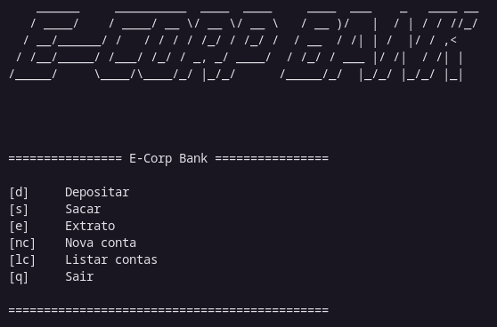

# 💵 E-corp Bank 💵

# sistema_bancario_v2.py

Opções de menu no Sistema Bancário

>"Faça o teu melhor, na condição que você tem, enquanto você não tem condições melhores, para fazer melhor ainda!"
<!-- Mario Sergio Cortella  --> 

## _*Projeto Desafio Criando um Sistema Bancário*_
O código do desafio anterior foi aprimorado com modularização usando funções para depósito, saque e exibição de extrato, além de criar e listar contas e usuários. O menu foi formatado para melhor exibição. As informações dos usuários são armazenadas em dicionários. O programa permite controle de conta bancária com opções para depósito, saque, extrato, criação de usuário e conta, e listagem de contas. As melhorias tornam o código mais organizado e funcional, proporcionando um sistema mais robusto para gerenciar múltiplas contas bancárias.

1. Potência Tech powered by iFood | Ciência de Dados- [acesse o curso](https://web.dio.me/track/potencia-tech-powered-ifood-ciencias-de-dados-com-python).

### 🔧 FUNCIONALIDADES
 

- [x] Cadastro de cliente
- [x] Criação de Conta Bancária
- [x] Depósito em Conta
- [x] Saque de Conta
- [x] Extrato da Conta
- [x] Listar Contas

#### 📌 MENU PRINCIPAL
 

  

### _*Meta concluída*_ 
1. Desafio de Projeto 
- [X] Done! :🚀👩‍💻

[^1]: Este Projeto tem como objetivo treinar os códigos em Python e ser acrescentado ao Portfólio.
